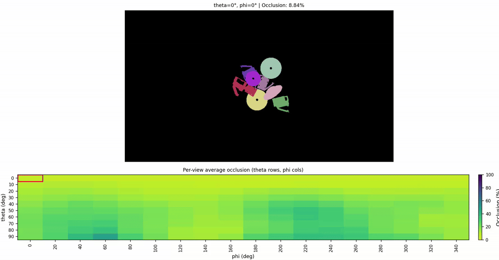
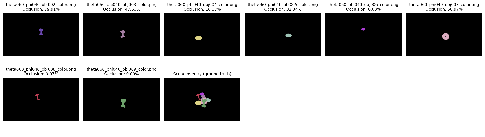
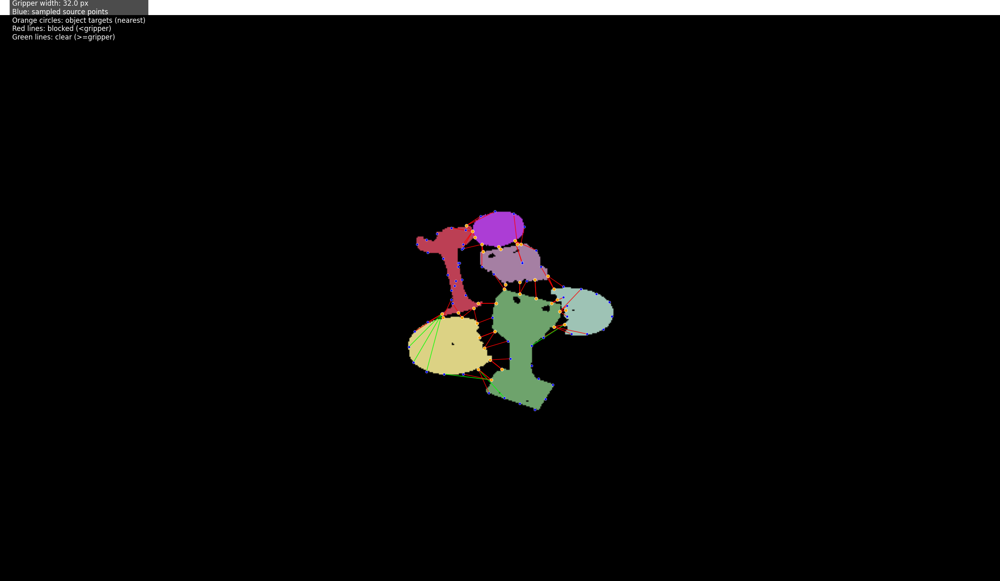
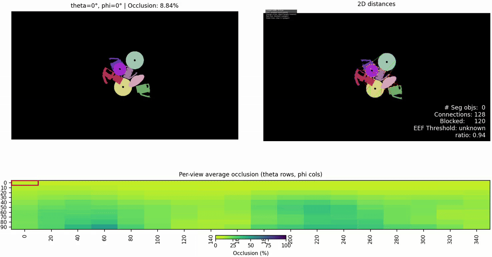

# Towards Quantification of Clutter in Robotic Grasping Scenes

Below are the ordered instructions on how to generate scenes and there corresponding ground truth segmentation masks that we use to evaluate each scene. 



## Installation
add docker instructions here and dependencies

## Generate Cluttered Scenes and Segmentation Masks:
This script creates a cluttered scene of objects on a platform in pybullet inspired by the creators of  [VGN](https://github.com/ethz-asl/vgn). From this scene we collect segmentation masks from multiple viewpoints around the scene to get a 3D representation from 2D viewpoints. Azimuth and Theta degrees are used to specify how many viewpoints around and above the scene respectfully. Lower values create more in detailed scene representations. 

```
cd data_collection
python3 create_scene.py --object-set <object_set> --remove-box
```
- Exclude "--remove-box" to have the bin persist throughout the collection process.
- Include "--sim-gui" to see the viewpoint collection process. This will slow down the collection process.
-  The example object set used is a subset of the [MOADV2](https://github.com/pgavriel/MOADv2) dataset. Create your own object set in the object_set folder following the same format as the objects in "object_sets/moadv2". Alternatively use "object_set/blocks" for simple generic objects as shown below.


```
python3 create_scene.py --object-set blocks --remove-box
```


The viewpoint data of the scene will be saved to a .npz. To generate the segmentation masks for each vewipoint run the following.
```
python3 visualize_npy.py --scene <object_set_name> 
```
This script will vizualize each vewipoints and each object from that viewpoints segmentation mask.


## Quantification  
From these segmentation masks generated above we are able to quantify each scene in a few methods. An occlusion metric and a distance evaluation metric (work in progress) 

### Occlusion
Occlusion represents the ratio between an object's ground-truth segmentation (as if all other objects in the scene were invisible) and its actual visible area from the given viewpoint. An object that is only 30% visible from a given viewpoint would be considered 70% occluded.

```  
cd ..
python3 scripts/calculate_occlusion.py --dataset_name <name_of_dataset>
```

This script computes the occlusion score for each object as well as the average occlusion for the entire viewpoint. It also produces images like below for each viewpoint.

The dataset name is the name of the object_set used for that scene. 




Run the script below for the interactive UI shown at the beginning of README showing occlusion scores from different viewpoints. 
```
python3 scripts/occlusion_visualization_ui.py --dataset_name <name_of_dataset>
```

<!--  -->

### Distance Evaluation
We have also began exploring some distance evaluation metrics from these segmentation masks. Objects that are closer together are generally harder to grasp we assume these scenes would be more cluttered compared to scenes with objects more spread apart.

Run the script to draw connection points from objects in each viewpoint
```
python3 ./scripts/calculate_distance.py --dataset-name <name_of_dataset>    --occlusion-threshold 50.0
```

This is an example resulting image from a single viewpoint. Notice we filter out objects that are above a certain occlusion threshold, We did this to make clearer connections between objects. We also believe objects above a certain occlusion threshold are ungraspable and the inclusion of them is not valuable. We are still exploring this metric and how we want to quantify it. 



Run the script below for the interactive UI shown at the beginning of README showing occlusion scores from different viewpoints that also includes the distance images. 
```
python3 ./scripts/occlusion_and_distance_visualization_ui.py ----dataset_name <name_of_dataset> --gripper-width 32
```

